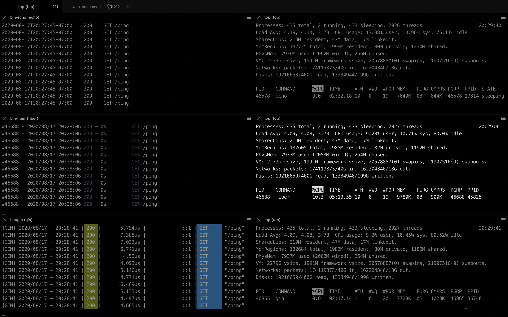
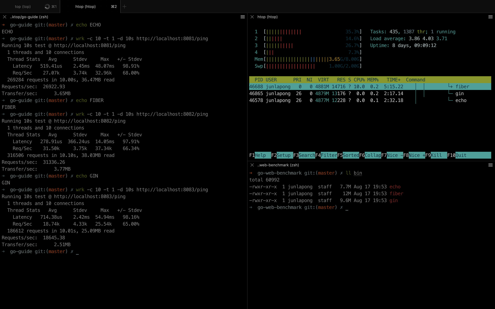

# go-web-benchmark

[echo](https://echo.labstack.com/), [fiber](https://gofiber.io/), [gin](https://gin-gonic.com/)

## Make

```
make
```

## Run

```
bin/echo
bin/fiber
bin/gin
```

## Load Test

```
make bench

# or
make wrk

# or
make hey
```

use [hey](https://github.com/rakyll/hey)

```
go get -u github.com/rakyll/hey
```

run

```
hey -n 100000 http://127.0.0.1:8080/ping

# or
hey -z 5s http://127.0.0.1:8080/ping
```

## HTTP Client Tools

use [curlie](https://curlie.io/)

```
go get -u -v github.com/rs/curlie
```

```
curlie localhost:8080/ping

HTTP/1.1 200 OK
Date: Sun, 16 Aug 2020 19:24:11 GMT
Content-Type: application/json
Content-Length: 18

{
    "message": "pong"
}
```

## Monitoring





```
# find process id
ps -ef | grep "bin/echo"
ps -ef | grep "bin/fiber"
ps -ef | grep "bin/gin"

# monitor process
top -pid <PIDx>
htop -p PID1, PID2, PID3

# find binary size
ls -lh bin
```

Add Spring Boot and Expresss

```
Test: wrk -c 10 -t 1 -d 10s http://localhost:<PORT>/ping

Spring Boot (Java)
Requests/sec:  18045.80     Memory: 228 M

Express (NodeJS)
Requests/sec:   3081.51     Memory:  56 M

Echo (Go)
Requests/sec:  26111.17     Memory:   8 M

Fiber (Go)
Requests/sec:  31180.85     Memory:  10 M

Gin (Go)
Requests/sec:  21254.17     Memory:   9 M
```
